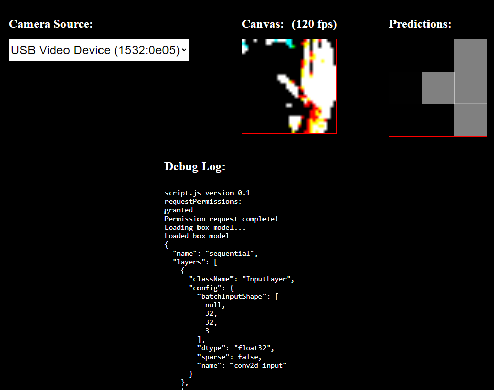

# HTML5_AIBoxCamera

This is a HTML5 sample for running an AI model in the browser with TensorFlow. The page has a canvas that renders a web camera. The pixels are sampled and sent to the model for prediction. The top predictions are drawn on the predictionc canvas.

Note: More training data needs to be added.

* [Demo](https://theylovegames.com/HTML5_AIBoxCamera/)

## Screenshots



## Dependencies

* [Python](https://www.python.org/)

* TensorFlow JS

```cmd
pip install tensorflowjs
```

## Training

```cmd
cd .\models
.\train_save_model_0.cmd
```
